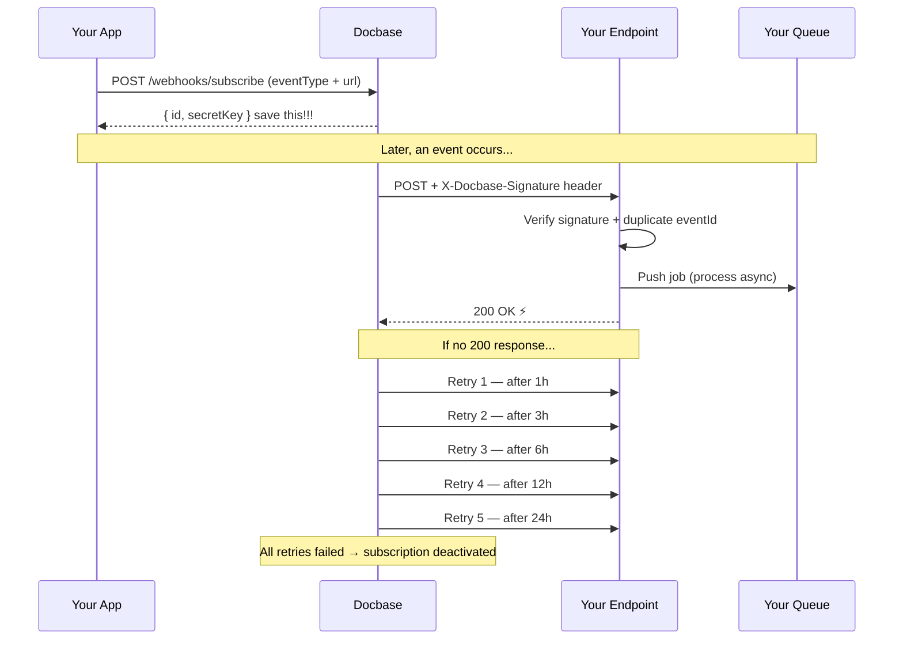

Webhooks are the most efficient way to get real-time updates from Docbase. Instead of constantly polling our API, Docbase proactively sends an HTTP POST request to your server the moment an event occurs.

## How it works



1. **Subscribe**: Register your endpoint and event type with Docbase. You receive a secret key to verify incoming requests.
2. **Event occurs**: An action happens in Docbase (e.g. a document is uploaded).
3. **HTTP POST**: Docbase sends a signed JSON payload to your endpoint with an `X-Docbase-Signature` header.
4. **Verify & acknowledge**: Your server verifies the signature, deduplicates using `eventId`, and returns `200 OK` immediately.
5. **Process async** _(your side)_: On your server, push the job to your own queue and process it in the background — don't do heavy work before responding to the webhook.
6. **Retries**: If your endpoint doesn't return `200 OK`, Docbase retries up to 5 times over 24 hours. After all retries fail, the subscription is deactivated.**Acknowledgment:** Your server must acknowledge receipt by returning a 2xx HTTP status code.

## Delivery Guarantees & Idempotency

- **At-Least-Once Delivery:** We guarantee that your webhook will be delivered. We store every delivery attempt in our database. If an event was already successfully delivered to your `SubscriptionId`, Docbase will skip duplicate dispatches.
- **Idempotency:** Despite our internal checks, network anomalies can happen. We strongly recommend using the `EventId` provided in the payload to make your webhook handler idempotent (ensure you don't process the exact same `EventId` twice).

## Retry Policy & Auto-Deactivation

Docbase implements a dual-layer resilience system to handle network instability or downtime on your servers:

**1. Immediate Transient Retries** If your server responds with a `5xx` error or there is a transient network failure, Docbase will immediately retry the request **up to 2 times** using an exponential backoff of ~200ms.

**2. Asynchronous Delayed Retries** If the immediate retries fail (or your server is completely unreachable), the event goes into our delayed retry queue. We will attempt to deliver the payload **5 more times** following this schedule:

- Attempt 1: In **1 hour**
- Attempt 2: In **3 hours**
- Attempt 3: In **6 hours**
- Attempt 4: In **12 hours**
- Attempt 5: In **24 hours**

<Warning>
  If all asynchronous retries are exhausted (meaning your server has been failing for over 46 hours), Docbase will automatically mark your webhook subscription as Inactive. You will need to manually reactivate it from your Developer Dashboard once your server is healthy.
</Warning>

<Info>
  To prevent overwhelming your servers, Docbase adds a random "jitter" of up to 5 minutes to each of these delayed attempts.
</Info>

## Standard Payload Structure

Every webhook sent by Docbase follows this exact JSON structure. **The Data object will vary depending on the EventType.**

```json
{
  "eventId": "3fa85f64-5717-4562-b3fc-2c963f66afa6",
  "eventType": "filecabinet.created",
  "subscriptionId": "123e4567-e89b-12d3-a456-426614174000",
  "timestamp": "2026-03-09T15:30:00.000Z",
  "data": {
	// ...
  }
}
```